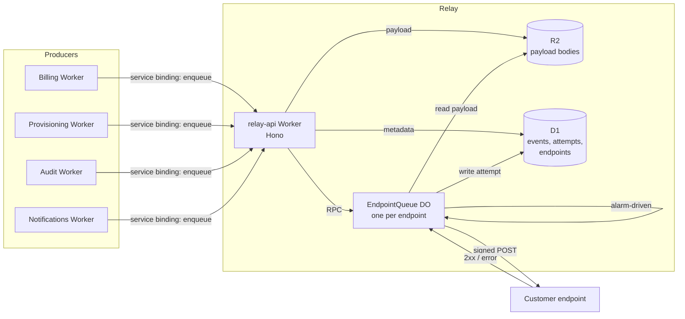

# Example: a complete design doc

A worked design doc for an outbound webhook delivery service. It is deliberately exhaustive — it exercises nearly every section in [`SECTIONS.md`](SECTIONS.md) so you can see each one written out. A real doc for a project this size would drop several of them; the [postscript](#postscript-what-a-leaner-version-would-cut) says which and why.

Read it for the shape and the register, not the specifics. Notice what it settles (signature format, storage split, delivery semantics, jurisdiction) and what it deliberately leaves to the implementation (retry jitter algorithm, table indexes, the admin UI layout).

---

# Relay

**URL**: https://go.example.com/relay-design
**Author**: Dana Okafor (dana@example.com)
**Created**: 2026-09-11
**Status**: In review
**Reviewers**: priya@ (platform), sam@ (security), jo@ (legal, privacy + jurisdiction sections only)

## Objective

Deliver Keystone's outbound webhooks to customer endpoints reliably, in order per endpoint, with a signature customers can verify — replacing the per-service delivery code that each product team currently writes by hand.

## Background

Keystone sends webhooks from four services today (Billing, Provisioning, Audit, Notifications). Each implemented delivery independently. The results, from the last two quarters:

- **Three incidents.** Billing retried a 500 response 40,000 times against one customer's endpoint over six hours (INC-4471). Provisioning dropped 1,900 events silently when its queue consumer OOMed with no DLQ (INC-4502). Audit sent events out of order, and a customer's state machine wedged (INC-4610).
- **Four different signature schemes.** Two of them are `HMAC(body)` with no timestamp, so a captured request replays forever. Our top three integrators have each asked why they need four verification code paths.
- **No delivery visibility.** Support answers "did you send it?" by grepping Workers logs, which retain 7 days at best. Last quarter that was 31 support tickets averaging 45 minutes each.

The pattern across all three incidents is the same: delivery is a hard distributed-systems problem, and we are solving it four times, badly. A single service lets us solve it once and gives customers one contract to integrate against.

This is the second attempt. A 2024 proposal (see Related documents) to add a shared library was abandoned because a library cannot own retry state — every service still needed its own queue, storage and backoff. Relay is a service for exactly that reason.

## Related documents

- [Webhook Delivery Library proposal, 2024](https://go.example.com/webhook-lib-2024) — the abandoned predecessor, and why a library is insufficient
- [INC-4471 / INC-4502 / INC-4610 postmortems](https://go.example.com/relay-incidents)
- [Keystone Public API style guide](https://go.example.com/api-style) — governs the customer-facing endpoints below
- [Relay test plan](https://go.example.com/relay-test-plan) — owned by QA, covers conformance and load testing

## Goals

- Deliver every accepted event at least once, or surface a terminal failure customers can see and act on
- Preserve per-endpoint ordering, so customer state machines can trust sequence
- Give customers one signature scheme to verify, across all Keystone products
- Let support answer "what happened to event X?" without engineer involvement
- Let a product team emit webhooks without writing delivery code

## Non-goals

- **Inbound webhooks.** Receiving third-party webhooks is a different problem with a different threat model. Out of scope entirely.
- **Fan-out to internal consumers.** Relay delivers to customer-controlled HTTPS endpoints. Internal service-to-service messaging stays on Queues.
- **Guaranteed exactly-once delivery.** Impossible over HTTP without endpoint cooperation. We guarantee at-least-once and give customers an idempotency key; deduplication is theirs.
- **Global ordering.** Ordering holds per destination endpoint, not across a customer's endpoints or across products.
- **A transformation or templating layer.** Producers send the payload they want delivered. Payload mapping per customer is a product feature, not delivery infrastructure.

## Scenarios

### Scenario 1: a normal delivery

1. Billing finalizes invoice `inv_8812` and calls Relay's enqueue API with the event type, the customer's endpoint ID, and a JSON payload.
2. Relay accepts synchronously, returns `evt_01J...`, and the Billing request completes. Billing's work is done.
3. Relay signs the payload and POSTs it to the customer's endpoint within 2 seconds.
4. The endpoint returns `200`. Relay records the attempt and marks the event delivered.
5. The customer sees the event, with its request and response headers, in the delivery log.

### Scenario 2: a failing endpoint recovers

1. A customer's endpoint starts returning `503` during their deploy.
2. Relay retries with exponential backoff: 10s, 40s, 3m, 12m, 45m, 3h, 12h.
3. Further events for that endpoint queue behind the failing one — ordering is preserved, not sacrificed to throughput.
4. After 15 minutes of consecutive failures, Relay emails the customer's registered technical contact once, and marks the endpoint degraded in their dashboard.
5. Their deploy finishes 20 minutes in. The next retry returns `200`. Relay drains the backlog in order.
6. Had the backoff run out at 24 hours, the events would move to terminal failure, stay visible in the log for 30 days, and be redeliverable by the customer with one click.

### Scenario 3: support answers a question

1. A customer reports that their billing integration missed an invoice.
2. Support opens Relay's internal console and searches by the customer's account ID and a time range.
3. They find `evt_01J...`, delivered, `200`, 340ms, at 14:02 UTC — response body excerpt included.
4. Support replies with the delivery timestamp and the customer's own `200`. Total time: two minutes, no engineer.

## Architecture



**Data flow.** A producer calls `enqueue` over a service binding. `relay-api` validates, writes the payload body to R2 and the event metadata to D1, then RPCs the Durable Object for that destination endpoint. The DO holds the per-endpoint delivery queue and drives attempts from its own alarm — it is the single writer for ordering and backoff state, which is precisely why a DO and not a Queue consumer. Every attempt writes a row to D1; the customer-facing log and the support console read from there.

## Glossary

- **Event** — one payload a producer wants delivered, with an identity (`evt_...`) that persists across retries.
- **Endpoint** — a customer-registered HTTPS URL plus its secrets and configuration. The unit of ordering and of the delivery queue.
- **Attempt** — one HTTP POST to an endpoint. An event has one or more.
- **Terminal failure** — the backoff schedule is exhausted; Relay will not retry unless a human asks.
- **Degraded** — an endpoint with consecutive failures over the alert threshold. A display state, not a behavioural one.
- **Producer** — an internal Keystone service that emits events.

## Constraints

- **Cloudflare Workers only.** Keystone runs entirely on Workers; there is no container platform to fall back on, so every component must fit the Workers execution model (no long-lived processes, no in-memory state that survives eviction).
- **Producers cannot block on delivery.** Billing's invoice finalization holds a database transaction. Enqueue must be synchronous and fast or producers will call it outside the transaction and lose events on crash.
- **Customer endpoints are arbitrary.** Any latency, any failure mode, any TLS configuration, and some are hostile or misconfigured. Relay cannot assume anything about them.
- **The signature contract is permanent.** Once a customer ships verification code, changing the scheme is a coordinated migration across every integrator. Treat it as immutable from launch.

## Interfaces

### Producer interface (internal, service binding)

```ts
interface RelayService {
  enqueue(req: {
    endpointId: string;
    eventType: string;        // e.g. "invoice.finalized"
    payload: unknown;         // serialized to JSON, ≤256 KB
    idempotencyKey?: string;  // producer-supplied; dedupes within 24h
  }): Promise<{ eventId: string }>;
}
```

Errors are typed and exhaustive: `endpoint_not_found`, `endpoint_disabled`, `payload_too_large`, `rate_limited`. Producers must handle each — a thrown generic error at enqueue time is a lost event.

### Delivery interface (the customer contract)

```
POST https://customer.example.com/hooks/keystone
Content-Type: application/json
Relay-Id: evt_01J8XQ2K9V3NBFWZ7YC4TMR6HD
Relay-Timestamp: 1789459200
Relay-Event-Type: invoice.finalized
Relay-Signature: v1=5d41402abc4b2a76b9719d911017c592...,v1=a3f5...
Relay-Attempt: 2
```

The signed string is `{timestamp}.{raw body}`, HMAC-SHA256, hex-encoded. Multiple `v1=` values appear during secret rotation — customers must accept a match against any of them. The scheme is versioned in the header prefix so a future `v2` can run alongside.

Customers must return a 2xx within **10 seconds**. Anything else — non-2xx, timeout, TLS failure, connection refused — is a failed attempt. `410 Gone` is the one special case: it disables the endpoint immediately rather than retrying, so customers can decommission an endpoint cleanly.

### Customer-facing API (public)

- `GET /v1/events` — list with filters on endpoint, type, status, time range
- `GET /v1/events/{id}` — event detail, every attempt, request and response headers
- `POST /v1/events/{id}/redeliver` — redeliver, preserving ordering position
- `POST /v1/endpoints/{id}/secrets` — add a secret; rotation is add-then-remove, never replace

Shapes follow the Keystone Public API style guide. No new conventions introduced here.

### Storage

D1 holds `endpoints`, `events` and `attempts`. R2 holds payload bodies, keyed `{accountId}/{eventId}`. The split exists because D1 rows are unsuited to 256 KB blobs and because payload bodies and metadata have different retention (below). Table and index details are implementation concerns and not settled here.

## Dependencies and infrastructure

- **Language**: TypeScript, `strict: true`. House standard.
- **Runtime**: Cloudflare Workers. Constraint, not a choice.
- **Framework**: Hono for the HTTP surface. Already the Keystone standard.
- **Durable Objects** for per-endpoint queue and backoff state. The one-way door of this design — see Alternatives.
- **D1** for event and attempt metadata. Reversible at moderate cost; the query surface is small and behind a repository boundary.
- **R2** for payload bodies. Reversible cheaply; keys are opaque.
- **Drizzle** as the D1 query layer, per house standard.
- **Email** via the existing Keystone notification service for degraded-endpoint alerts. Replaceable in an afternoon; not discussed further.

## Service level objectives

- **Enqueue availability**: 99.95% monthly, measured at the service binding
- **Enqueue latency**: p50 ≤ 25ms, p99 ≤ 120ms
- **Time to first attempt**: p95 ≤ 2s, p99 ≤ 10s from enqueue
- **Delivery durability**: zero accepted events lost — an accepted event reaches terminal state (delivered or terminally failed) or is still retrying. This one is absolute; a durability miss is an incident regardless of rate.
- **Throughput**: sustained 800 events/s, burst 3,000 events/s for 60s
- **Log query latency**: p95 ≤ 500ms for a 30-day range on a single account

Time-to-first-attempt excludes time spent queued behind a customer's own failing endpoint — we cannot be held to an SLO their outage controls.

## Monitoring and alerting

Pages the on-call engineer:

- Enqueue 5xx rate ≥ 1% over a 5-minute window
- Enqueue p99 latency ≥ 500ms over a 10-minute window
- Global delivery success rate < 90% over 15 minutes (a Relay-side fault; individual endpoint failures are expected and excluded)
- Any event with no attempt within 60s of enqueue — the durability canary
- DO alarm backlog depth ≥ 10,000 across all endpoints

Ticket, not page:

- A single endpoint degraded for ≥ 6 hours (customer's problem, but support should know)
- Terminal failure rate ≥ 5% of daily volume
- R2 or D1 storage growth ≥ 20% week-over-week

Dashboards cover per-product volume, delivery latency distribution, retry depth, and the top 20 endpoints by failure rate.

## Logging

Structured JSON to Workers Logs, shipped to the central sink, 30-day retention.

- **info**: event accepted (id, account, endpoint, type, size); attempt completed (id, attempt number, status, duration)
- **warn**: attempt failed with a retryable status; endpoint entering degraded; payload near the size limit
- **error**: R2 or D1 write failure; DO alarm failure; signature computation failure
- **critical**: any accepted event with no attempt after 60s — pages

**Never logged**: payload bodies, endpoint secrets, customer response bodies beyond the first 256 bytes, and full request headers from customer responses (which may carry `Set-Cookie` or auth material). Payload bodies live in R2 under the access controls below, and nowhere else.

Access to the log sink follows the existing Keystone production access policy: SSO plus an associated ticket number.

## Timeline

- **M1 — 2026-09-29**: `relay-api` accepts enqueues and persists them; delivery stubbed. Producers can integrate against a real interface. Test environment only.
- **M2 — 2026-10-13**: EndpointQueue DO delivers with ordering, backoff and signing. End-to-end in test against a mock customer endpoint.
- **M3 — 2026-10-27**: Customer-facing log API and support console. QA conformance suite green.
- **M4 — 2026-11-10**: Audit migrated in production behind a flag — lowest volume, most tolerant consumers. Two weeks of soak.
- **M5 — 2026-11-24**: Billing and Provisioning migrated. Old delivery code deleted, not left dormant.
- **M6 — 2026-12-08**: Notifications migrated. Relay is the only delivery path. Public documentation of the signature scheme published.

M1 exists to surface interface misunderstandings while they are still cheap. Producers integrate against the real enqueue signature four weeks before anything is actually delivered.

## Security

**Threats considered:**

- **Forged webhooks.** An attacker POSTs to a customer's endpoint pretending to be Keystone. Mitigated by HMAC-SHA256 over `{timestamp}.{body}` with a per-endpoint secret the customer holds.
- **Replay.** A captured request is resent later. Mitigated by the signed timestamp; documentation instructs customers to reject signatures older than 5 minutes. This is the specific hole in two of the four existing schemes.
- **SSRF via customer endpoints.** A customer registers `http://169.254.169.254/` or an internal hostname and uses Relay as a proxy into our network. Mitigated by requiring HTTPS, resolving and rejecting private, link-local, loopback and metadata address ranges at registration *and* at delivery time (DNS rebinding defeats registration-time checks alone), and by running delivery through a Worker with no internal service bindings.
- **Secret exposure.** Endpoint secrets are stored encrypted at rest with a key from Workers Secrets Store, are never logged, and are write-only through the API — creation returns the value once and it is never readable again.
- **Enqueue abuse by a compromised producer.** Producers reach Relay only over service bindings, never a public route. A compromised producer can enqueue to its own account's endpoints only; the binding carries the calling service identity and Relay enforces product scope on `endpointId`.
- **Amplification.** A customer registering many endpoints and enqueueing heavily turns Relay into a DoS source. Per-account enqueue rate limits and a per-account cap on endpoints.

**Trust boundaries**: producer → Relay (authenticated by service binding, inputs validated); Relay → customer endpoint (fully untrusted in both directions — response bodies are truncated, never parsed, never executed); customer → public API (authenticated by Keystone API key, scoped to the account).

## Privacy

Relay payloads carry whatever the producing service puts in them, which today includes customer names, email addresses, billing addresses and invoice line items — personal data under GDPR, for which Keystone is the controller and Cloudflare a processor under the existing DPA.

- **Retention**: payload bodies in R2 for **7 days**, then deleted by lifecycle rule. Event and attempt metadata in D1 for **30 days**. Metadata excludes payload content but includes the endpoint URL and event type.
- **Rationale for the split**: support and redelivery need bodies for days, not weeks; the log needs metadata for a month to answer billing-cycle questions. Keeping bodies for 30 days would quadruple the personal data we hold for no operational gain.
- **Access**: payload bodies are readable by on-call engineers via an audited internal tool that requires a ticket number, and by the owning customer through the delivery log. Not readable in the support console — support sees metadata and truncated response bodies only.
- **Encryption**: TLS 1.2+ in transit (delivery refuses lower); R2 and D1 encrypt at rest by default.
- **Deletion requests**: an erasure request resolves within the 7-day payload window without special handling. Metadata rows are pseudonymized, not deleted, since they carry no payload content.

## Legal

**EU data residency.** Two enterprise contracts (Nordwind, Voltaire) commit Keystone to processing their data within the EU. Durable Object jurisdiction is fixed at namespace creation and **cannot be changed afterwards** — an EU-jurisdiction DO cannot be converted, and events would have to be drained and re-enqueued into a new namespace to move.

We will therefore create two DO namespaces from the start: `ENDPOINT_QUEUE` (unrestricted) and `ENDPOINT_QUEUE_EU` (jurisdiction: `eu`), routing by the account's residency flag. Provisioning both at launch costs us almost nothing; retrofitting the EU namespace after those accounts are live is a migration with a delivery pause. This is the most expensive-to-reverse decision in the document and the reason legal is a named reviewer.

R2 buckets are similarly split by jurisdiction, with the same reasoning.

**Signature scheme documentation** becomes part of the public API surface and falls under the Keystone API deprecation policy: 12 months' notice before any breaking change. Confirmed with jo@ that publishing the scheme creates no additional obligation beyond that policy.

## Open issues

### Open issue: backoff schedule length

Seven attempts over 24 hours is a guess calibrated against Stripe (3 days) and GitHub (~8 hours). Longer means a customer's overnight outage resolves without their intervention; it also means we hold undelivered payloads past the 7-day R2 window if we ever extend much further, and it deepens the ordering backlog behind a dead endpoint.

**Options**: (a) 24 hours as proposed; (b) 72 hours, matching Stripe, at roughly 3× peak backlog depth; (c) make it per-endpoint configurable, which pushes the decision to customers but adds a support surface and an SLO we cannot reason about.

**Proposed**: ship (a). It is a two-line change to extend, and nothing downstream is built on the number.

**Next step**: dana@ to check the three 2026 incidents for how long customer outages actually ran. Decide before M2.

### Open issue: ordering during redelivery

A customer redelivers a 3-day-old event. Does it go to the head of the queue (correct by original order, but reordered relative to everything delivered since), or the tail (correct by wall clock, wrong by sequence)?

**Options**: (a) tail, documented as "redelivery is out of order by design"; (b) head, and accept that a customer's state machine may see an old event after a newer one; (c) refuse redelivery for events older than the ordering window.

**Proposed**: (a). Redelivery is a human-initiated repair action, and pretending it preserves ordering is a worse lie than saying plainly that it does not.

**Next step**: priya@ to confirm no product commitment contradicts this. Decide before M3.

## Resolved issues

### Resolved: payload size limit

**Decision**: 256 KB, rejected at enqueue with `payload_too_large`.

Audit's largest current event is 94 KB and Billing's is 31 KB. 256 KB clears both with headroom and stays well inside R2 and DO message limits. A producer needing more should send a reference and let the customer fetch — which is better integration design regardless of our limit. Raising the ceiling later is easy; lowering it after customers depend on it is not, which argues for starting conservative.

### Resolved: Queues vs Durable Objects for delivery

**Decision**: Durable Objects, one per endpoint.

Cloudflare Queues gives us retries and a DLQ for free and would be less code. It does not give us per-endpoint ordering: a queue consumer processes batches concurrently, and serializing per endpoint inside a consumer means external locking, which is a Durable Object with extra steps. Ordering is a stated goal driven by a real incident (INC-4610), so the choice follows from the goal.

The cost is real and worth stating: one DO per endpoint means tens of thousands of objects, per-object cost, and a cold-start on the first delivery to a quiet endpoint. We accept the cold start — it lands inside the 2s time-to-first-attempt budget in testing (measured: 340ms p95).

## Alternatives considered

- **Cloudflare Queues instead of Durable Objects.** Covered under Resolved issues. Rejected on ordering.
- **A shared library in each producer.** The 2024 proposal. A library cannot own retry state, so each service still needs its own queue, storage, backoff and delivery log — which is four implementations again, with a common HMAC function. Rejected as not solving the actual problem.
- **A third-party service (Svix, Hookdeck).** Genuinely strong: both do this better than a first version of Relay will. Rejected on the data-residency commitments above (neither offered EU-only processing at a price we could justify for two accounts) and on payload sensitivity — routing invoice line items through a third processor triggers a DPA renegotiation with every enterprise customer. Worth revisiting if residency ever stops being a constraint.
- **Delivering synchronously from producers with a retry queue only for failures.** Fewer moving parts, and the happy path skips a hop. Rejected because it puts an arbitrary customer endpoint's latency inside Billing's transaction, which is how INC-4471 started.
- **Postgres via Hyperdrive instead of D1.** Better query surface for the delivery log, and we run Postgres elsewhere. Rejected because it adds a connection-pooling dependency and an operational surface for what is a small, append-heavy schema with simple queries. Revisit if log query latency misses its SLO.

---

## Postscript: what a leaner version would cut

This document runs long to show every section. For a project of this size — one team, one quarter, moderate risk — a real doc would likely drop:

- **Glossary**, by defining the four terms inline at first use.
- **Scenarios 2 and 3**, keeping one to establish the shape.
- **Logging**, if the org has a house logging standard the doc can cite in one line.
- **Timeline**, if milestones live in the tracker and would immediately go stale here.

What it would keep, because each names a decision that is expensive to get wrong: the signature contract, the DO-vs-Queues choice, the jurisdiction split, retention periods, the SSRF mitigations, and the delivery semantics. That is the cost-of-error test doing its job — the sections above survive on it, not on being part of a template.
